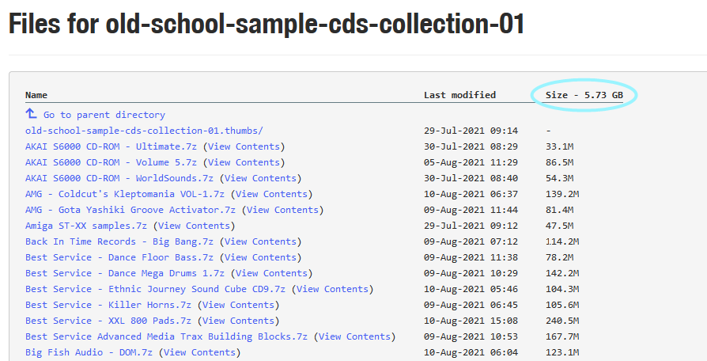

# Archive.org-show-total-size

This UserScript will show the total size of the current item in the archive.

It will also calculate the size of all the items in a folder when you go to view the download page.

At the moment I am very dumb and need to use another library to translate the size to not just 0.003GB or something.

<!-- add image embeds of examples/details.png and examples/file_listing.png -->

;

;